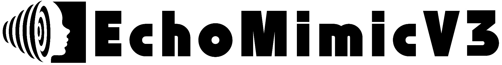
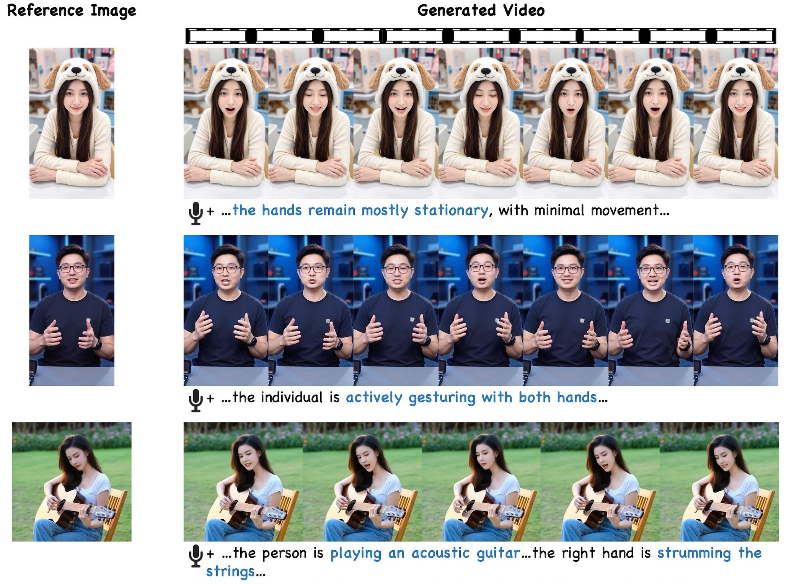
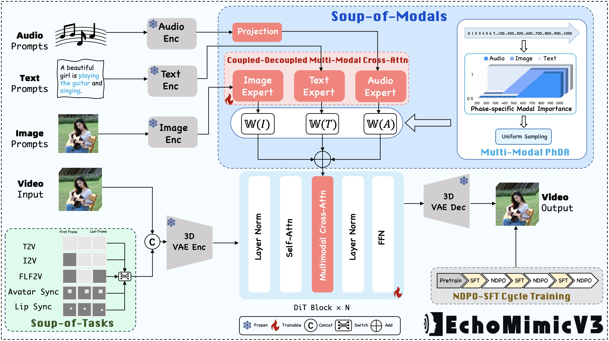

<p align="center">
  
</p>

<h1 align='center'>EchoMimicV3: 1.3B Parameters are All You Need for Unified Multi-Modal and Multi-Task Human Animation</h1>

<div align='center'>
    <a href='https://github.com/mengrang' target='_blank'>Rang Meng</a><sup>1</sup>&emsp;
    <a href='https://github.com/' target='_blank'>Yan Wang</a>&emsp;
    <a href='https://github.com/' target='_blank'>Weipeng Wu</a>&emsp;
    <a href='https://github.com/' target='_blank'>Ruobing Zheng</a>&emsp;
    <a href='https://lymhust.github.io/' target='_blank'>Yuming Li</a><sup>2</sup>&emsp;
    <a href='https://openreview.net/profile?id=~Chenguang_Ma3' target='_blank'>Chenguang Ma</a><sup>2</sup>
</div>
<div align='center'>
Terminal Technology Department, Alipay, Ant Group.
</div>
<p align='center'>
    <sup>1</sup>Core Contributor&emsp;
    <sup>2</sup>Corresponding Authors
</p>
<div align='center'>
    <a href='https://antgroup.github.io/ai/echomimic_v3/'></a>
    <a href='https://huggingface.co/BadToBest/EchoMimicV3'></a>
    <a href='https://arxiv.org/abs/2507.03905'></a>
    <a href='https://github.com/antgroup/echomimic_v3/blob/main/asset/wechat_group.png'></a>
    <!--<a href='https://antgroup.github.io/ai/echomimic_v2/'></a>-->
    <!-- <a href='https://modelscope.cn/models/BadToBest/EchoMimicV3'></a> -->
    <!--<a href='https://antgroup.github.io/ai/echomimic_v2/'></a>-->
    <!-- <a href='https://openaccess.thecvf.com/content/CVPR2025/papers/Meng_EchoMimicV2_Towards_Striking_Simplified_and_Semi-Body_Human_Animation_CVPR_2025_paper.pdf'></a> -->
    
</div>
<!-- <div align='center'>
    <a href='https://github.com/antgroup/echomimic_v3/discussions/0'></a>
    <a href='https://github.com/antgroup/echomimic_v3/discussions/1'></a>
</div> -->

## &#x1F680; EchoMimic Series
* EchoMimicV3: 1.3B Parameters are All You Need for Unified Multi-Modal and Multi-Task Human Animation. [GitHub](https://github.com/antgroup/echomimic_v3)
* EchoMimicV2: Towards Striking, Simplified, and Semi-Body Human Animation. [GitHub](https://github.com/antgroup/echomimic_v2)
* EchoMimicV1: Lifelike Audio-Driven Portrait Animations through Editable Landmark Conditioning. [GitHub](https://github.com/antgroup/echomimic)


## &#x1F4E3; Updates
<!-- * [2025.02.27] 🔥 EchoMimicV2 is accepted by CVPR 2025.
* [2025.01.16] 🔥 Please check out the [discussions](https://github.com/antgroup/echomimic_v2/discussions) to learn how to start EchoMimicV2.
* [2025.01.16] 🚀🔥 [GradioUI for Accelerated EchoMimicV2](https://github.com/antgroup/echomimic_v2/blob/main/app_acc.py) is now available.
* [2025.01.03] 🚀🔥 **One Minute is All You Need to Generate Video**. [Accelerated EchoMimicV2](https://github.com/antgroup/echomimic_v2/blob/main/infer_acc.py) are released. The inference speed can be improved by 9x (from ~7mins/120frames to ~50s/120frames on A100 GPU).
* [2024.12.16] 🔥 [RefImg-Pose Alignment Demo](https://github.com/antgroup/echomimic_v2/blob/main/demo.ipynb) is now available, which involves aligning reference image, extracting pose from driving video, and generating video.
* [2024.11.27] 🔥 [Installation tutorial](https://www.youtube.com/watch?v=2ab6U1-nVTQ) is now available. Thanks [AiMotionStudio](https://www.youtube.com/@AiMotionStudio) for the contribution.
* [2024.11.22] 🔥 [GradioUI](https://github.com/antgroup/echomimic_v2/blob/main/app.py) is now available. Thanks @gluttony-10 for the contribution.
* [2024.11.22] 🔥 [ComfyUI](https://github.com/smthemex/ComfyUI_EchoMimic) is now available. Thanks @smthemex for the contribution.
* [2024.11.21] 🔥 We release the EMTD dataset list and processing scripts.
* [2024.11.21] 🔥 We release our [EchoMimicV2](https://github.com/antgroup/echomimic_v2) codes and models. -->
* [2025.08.08] 🔥 We release our [codes](https://github.com/antgroup/echomimic_v3) and [models](https://huggingface.co/BadToBest/EchoMimicV3).
* [2025.07.08] 🔥 Our [paper](https://arxiv.org/abs/2507.03905) is in public on arxiv.

## &#x1F305; Gallery
<p align="center">
  
</p>
<p align="center">
  
</p>
<table class="center">
<tr>
    <td width=100% style="border: none">
        <video controls loop src="https://github.com/user-attachments/assets/f33edb30-66b1-484b-8be0-a5df20a44f3b" muted="false"></video>
    </td>
</tr>
</table>
For more demo videos, please refer to the project page.

## Quick Start
### Environment Setup
- Tested System Environment: Centos 7.2/Ubuntu 22.04, Cuda >= 12.1
- Tested GPUs: A100(80G) / RTX4090D (24G) / V100(16G)
- Tested Python Version: 3.10 / 3.11

### 🛠️Installation
#### 1. Create a conda environment and install pytorch, xformers
```
conda create -n echomimic_v3 python=3.10
conda activate echomimic_v3
```

#### 2. Other dependencies
```
pip install -r requirements.txt
```
### 🧱Model Preparation

| Models        |                       Download Link                                           |    Notes                      |
| --------------|-------------------------------------------------------------------------------|-------------------------------|
| Wan2.1-Fun-1.3B-InP  |      🤗 [Huggingface](https://huggingface.co/spaces/alibaba-pai/Wan2.1-Fun-1.3B-InP)       | Base model
| wav2vec2-base |      🤗 [Huggingface](https://huggingface.co/facebook/wav2vec2-base-960h)          | Audio encoder
| EchoMimicV3      |      🤗 [Huggingface](https://huggingface.co/BadToBest/EchoMimicV3)              | Our weights

-- The **weights** is organized as follows.

```
./models/
├── Wan2.1-Fun-1.3B-InP
├── wav2vec2-base-960h
└── transformer
    └── diffusion_pytorch_model.safetensors
``` 
### 🔑 Quick Inference
```
python infer.py
```
> Tips
> - Audio CFG: Audio CFG works optimally between 2~3. Increase the audio CFG value for better lip synchronization, while decreasing the audio CFG value can improve the visual quality.
> - Text CFG: Text CFG works optimally between 4~6. Increase the text CFG value for better prompt following, while decreasing the text CFG value can improve the visual quality.
> - TeaCache: The optimal range for `--teacache_thresh` is between 0~0.1.
> - Sampling steps: 5 steps for talking head, 15~25 steps for talking body. 
> - ​Long video generation: If you want to generate a video longer than 138 frames, you can use Long Video CFG.


## 📝 TODO List
| Status | Milestone                                                                |     
|:--------:|:-------------------------------------------------------------------------|
|    2025.08.08    | The inference code of EchoMimicV3 meet everyone on GitHub   | 
|    🚀    | Preview version Pretrained models trained on English and Chinese on HuggingFace | 
|    🚀    | Preview version Pretrained models trained on English and Chinese on ModelScope   | 
|    🚀    | 720P Pretrained models trained on English and Chinese on HuggingFace | 
|    🚀    | 720P Pretrained models trained on English and Chinese on ModelScope   | 
|    🚀    | The training code of EchoMimicV3 meet everyone on GitHub   | 


## &#x1F4D2; Citation

If you find our work useful for your research, please consider citing the paper :

```
@misc{meng2025echomimicv3,
  title={EchoMimicV3: 1.3B Parameters are All You Need for Unified Multi-Modal and Multi-Task Human Animation},
  author={Rang Meng, Yan Wang, Weipeng Wu, Ruobing Zheng, Yuming Li, Chenguang Ma},
  year={2025},
  eprint={2507.03905},
  archivePrefix={arXiv}
}
```

## &#x1F31F; Star History
[](https://star-history.com/#antgroup/echomimic_v3&Date)
